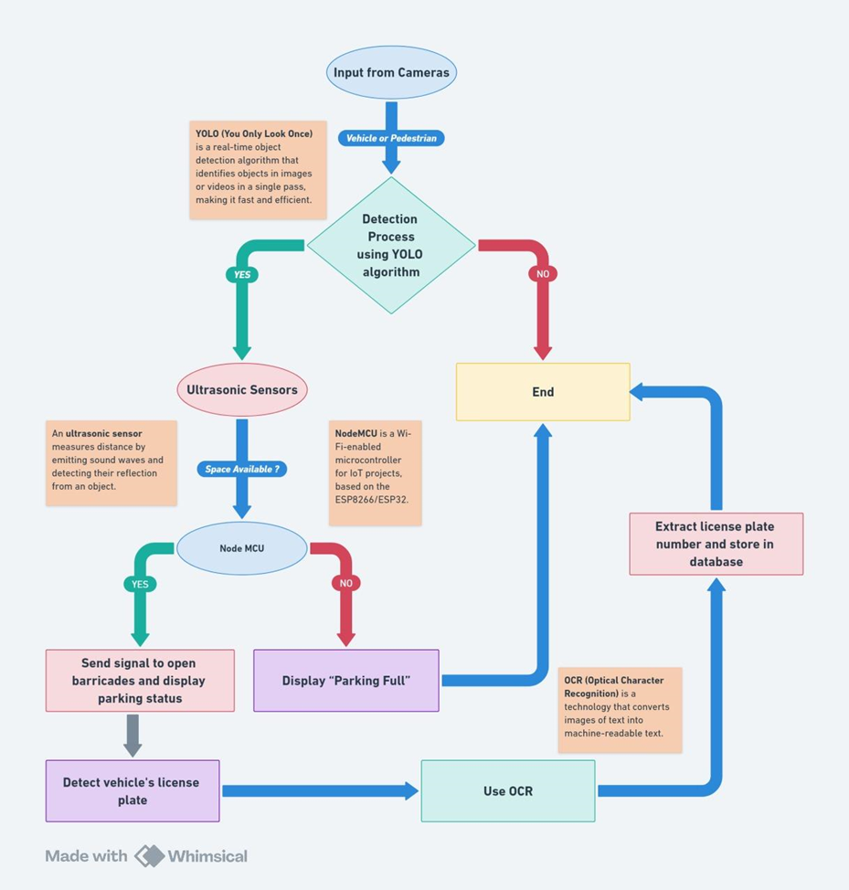
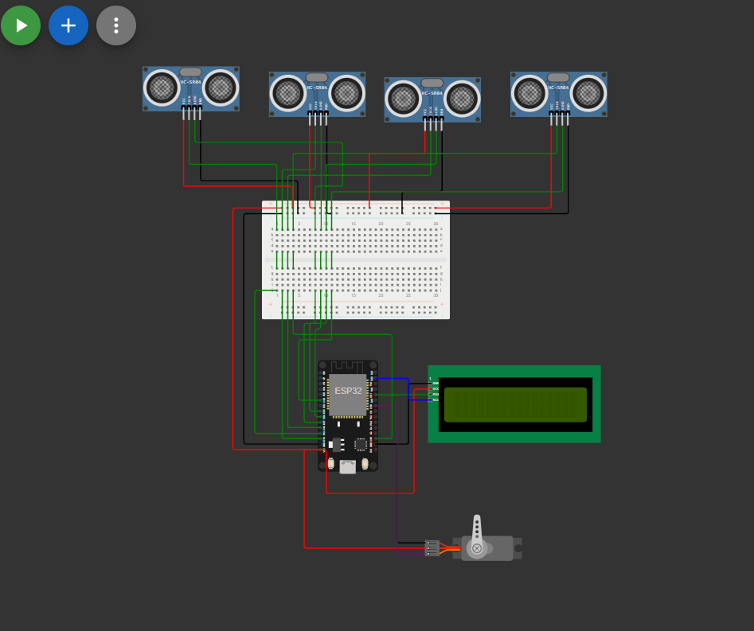
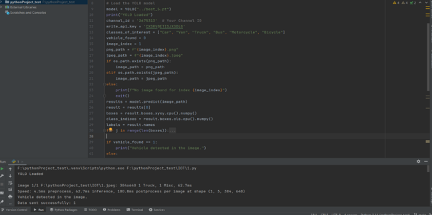
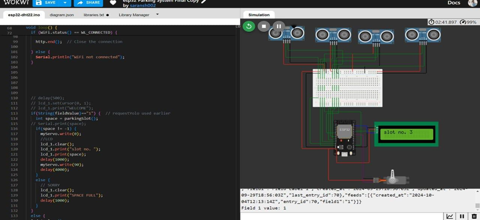
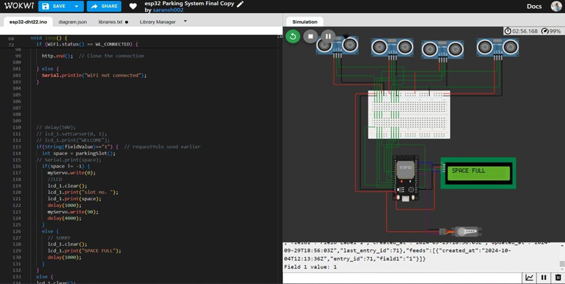
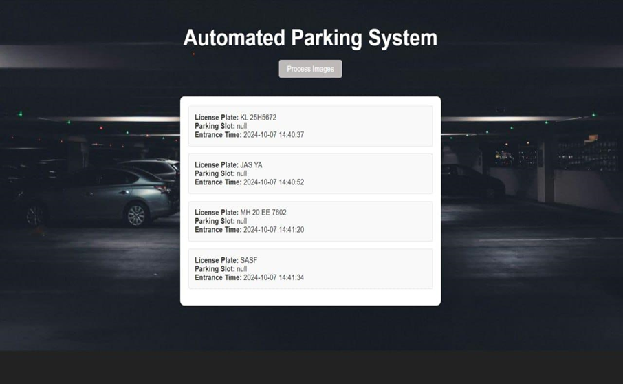
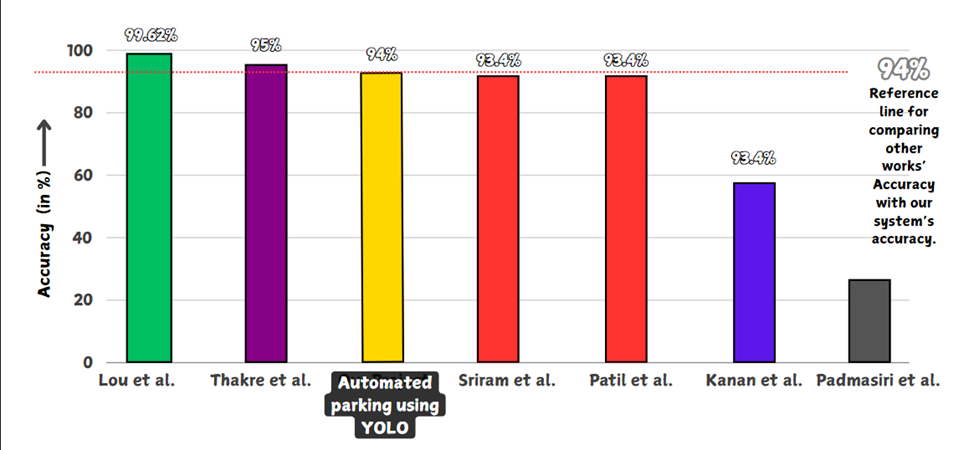

# **IoT-Based Smart Parking System**

## **Overview**
The **Automated Parking System** is a Flask-based application that utilizes **YOLO** for vehicle and license plate detection, **Tesseract OCR** for license plate recognition, and **ThingSpeak API** for real-time parking slot management and parking system is managed by ESP32 and output is shown by a screen.
**For Detailed Project report for this project [ClickHere](https://docs.google.com/document/d/1eMI91i_AxunxBf9wceRgtuGP6XGCJUhY/edit?usp=sharing&ouid=114326110509733353084&rtpof=true&sd=true)


## **Features**
- **Real-time Vehicle Detection**: Uses YOLOv8 to identify incoming vehicles and capture license plates via OCR.
- **Automated Parking Management**: Determines parking slot availability using ultrasonic sensors.
- **Smart Entry & Exit Control**: If a parking slot is available, the system opens the gate automatically.
- **Cloud-Based Data Storage**: Stores vehicle entry and exit details in a database.
- **Live Slot Display**: An LCD screen at the entrance shows real-time slot availability.
- **IoT Communication**: Uses ESP32 to communicate with the cloud via Flask and ThingSpeak.
- **Web Interface**: Displays processed data using a Flask web app.
 
## Performance Metrics For YOLO Vehicle and Pedestrian Detection 

| Metric     | Value   |
|------------|---------|
| Accuracy   | 94%     |
| Precision  | 95%     |
| Recall     | 95.7%   |
| F1-Score   | 95.34%  |
| IoU        | 0.83    |
| mAP@0.50   | 94.61%  |

## Implementation Table
| Component         | Model                          | Use                                                                 |
|-------------------|--------------------------------|---------------------------------------------------------------------|
| Camera            | YOLOv8                         | Detects vehicles approaching the parking area and captures license plates. |
| Node MCU          | ESP8266                        | Controls gate operations based on slot availability, integrates with cloud data. |
| Ultrasonic Sensor | HC-SR04                        | Checks if parking slots are vacant or occupied, sending status updates to the MCU. |
| LCD Display       | I2C LCD                        | Displays available slot numbers or 'Space Full' message at the parking entry. |
| Cloud Platform    | ThingSpeak                     | Receives and stores vehicle entry/exit data from the YOLO model for tracking. |
| Simulation        | Wokwi                          | Visualizes the system's complete setup, integrating all IoT components for testing. |
| OCR               | Optical Character Recognition (OCR) | Captures license plate details for vehicle tracking and billing. |


## **Tech Stack**
- **Backend**: Flask
- **Computer Vision**: YOLO (Ultralytics), OpenCV
- **OCR**: Tesseract
- **Cloud Integration**: ThingSpeak API
- **Frontend**: HTML, JavaScript (via Flask templates)
- **IOT**: Arduino INO

## **Installation**

```bash
1) Clone the Repository
git clone https://github.com/SaranshGupta02/Automated-Parking-System.git
cd Automated-Parking-System

2) Install Dependencies
pip install flask ultralytics opencv-python pytesseract requests

3) Set Up Tesseract
# Download and install Tesseract OCR from https://github.com/UB-Mannheim/tesseract/wiki
# Then update the path in `app.py`
pytesseract.pytesseract.tesseract_cmd = r'C:\Program Files\Tesseract-OCR\tesseract.exe'

4) Run the Application
python app.py

5) Go to Wokwi simulator and clone the file
https://wokwi.com/projects/410388066527542273

6) You can even run this entire project on VS Code by just setting up the Wokwi extension in VS Code
```

## **API Endpoints**
| Endpoint         | Method | Description                                                       |
|-----------------|--------|-------------------------------------------------------------------|
| `/`             | GET    | Renders the homepage                                            |
| `/process_images` | GET    | Detects vehicles, extracts license plates, and retrieves parking slot info |

## **Workflow**
1. Load 5 images (in `.jpg`, `.jpeg`, or `.png` format).
2. YOLO model detects vehicles (Car, Van, Truck, Bus, Motorcycle, Bicycle).
3. If a vehicle is detected:
   - YOLO model detects the license plate.
   - OpenCV extracts the bounding box.
   - Tesseract OCR reads the plate number.
4. Send vehicle detection data to ThingSpeak.
5. The ESP32 retrieves the available parking slots by ultrasonic sensors
6. If parking slot is available then display the slot number on screen and sent data to ThingSpeak.
7. Wait 10 seconds for parking slot data update.
8. Retrieve slot information from ThingSpeak.
9. Display detected vehicle, license plate, and slot information in the web interface.


*flowchart of smart parking system using YOLOv8 , ultrasonic sensors and Node MCU*

## **How It Works**
1. The system loads and processes images using YOLO.
2. If a vehicle is detected, the license plate is extracted via OCR.
3. The detection data is sent to ESP32 via Thingspeak.
4. The ESP32 retrieves the available parking slots by ultrasonic sensors
5. If parking slot is available then display the slot number on screen and sent data to ThingSpeak.
6. The data is displayed in the Flask web interface.


*idol system*


*Internal Python code Snippet used for detection of vehicle and sending signal to cloud accordingly*


*The NodeMCU starts to work only when it receives the field value 1*


*Servo motor works only when at least one of the spaces is unoccupied , i.e. Gates Open*


*Servo motor does not work when all the Slots Are Occupied , i.e. Gates does not open*


*The interface of webpage that stores the data*


## **Project Structure**
```bash
📂 Automated-Parking-System
 ┣ 📂 templates
 ┃ ┗ 📜 index.html
 ┣ 📜 app.py
 ┣ 📜 best_5.pt  # YOLO model for vehicle detection
 ┣ 📜 License.pt # YOLO model for license plate detection
 ┣ 📜 requirements.txt  # Dependency list
 ┗ 📜 README.md

📂 INO files
 ┣ 📜 diagram.json #connections and Used for Simulation if using in VS code
 ┣ 📜 esp32-dht22.ino  # Code for the ESP32 Module
 ┣ 📜 libraries.txt # Libraries Used
 ┗ 📜 wokwi-project.txt 

```

## **Comparison With Existing similar Tech**
The graph shows that YOLOv8, which we used for object detection, achieves a 94% accuracy. This is significant because it’s comparable to many of the other systems and even better than a few. Unlike systems that rely on predefined outputs, YOLOv8 uses AI to detect objects in real-time, adapting to different situations and conditions. This shows that our approach is very reliable, even when compared to other models that also use AI or a combination of sensors. 

*A Bar Graph comparing Accuracy of different systems with ours*

## **Future Improvements**
✅ Integrate real-time video processing for live camera feeds.
✅ Implement a database for vehicle entry logs.
✅ Add user authentication for managing parking slots.

